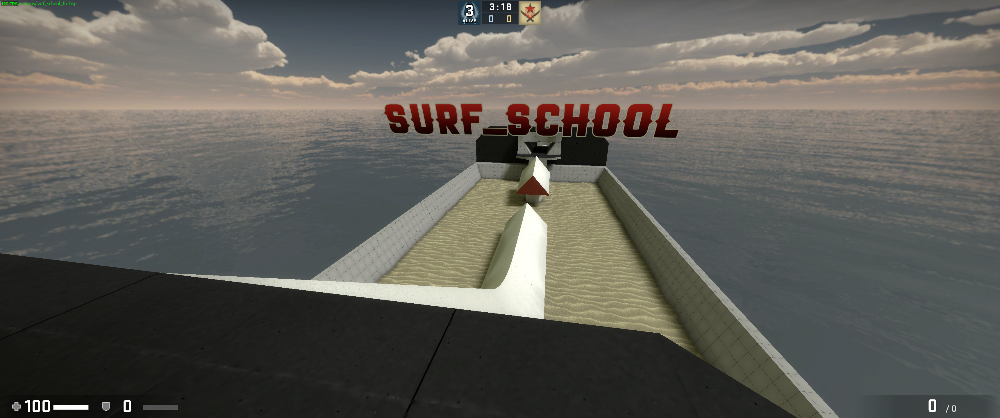

# 20240310 My Favourite Surf Maps

- [20240310 My Favourite Surf Maps](#20240310-my-favourite-surf-maps)
  - [All maps](#all-maps)
  - [Tier 1](#tier-1)
    - [`surf_calcyate2`](#surf_calcyate2)
    - [`surf_nuclear`](#surf_nuclear)
    - [`surf_school`](#surf_school)
  - [Tier 2](#tier-2)
    - [`surf_ivory`](#surf_ivory)

## All maps

| map | tier | surf style | aesthetic |
|--|--|--|--|
| [`surf_calcyate2`](#surf_calcyate2) | 1 | smooth | concrete/foliage |
| [`surf_nuclear`](#surf_nuclear) | 1 | easy | concrete bunker |
| [`surf_school`](#surf_school) | 1 | "learn to surf" | sand, sea & ramps |
| [`surf_ivory`](#surf_ivory) | 2 | smooth | marble architecture/foliage |
| [`surf_calzone`](#surf_calzone) | 2 | smooth | stained glass/large concrete spaces |

## Tier 1

### `surf_calcyate2`

| category | value |
|--|--|
| surf style | smooth |
| aesthetic | concrete/foliage |

### `surf_nuclear`

| category | value |
|--|--|
| surf style | easy |
| aesthetic | concrete bunker |

### `surf_school`

| category | value |
|--|--|
| surf style | "learn to surf" |
| aesthetic | sand/sea |

## Tier 2

### `surf_ivory`

| category | value |
|--|--|
| surf style | smooth |
| aesthetic | marble architecture/foliage |

### `surf_calzone`

| category | value |
|--|--|
| surf style | smooth |
| aesthetic | stained glass/large concrete spaces |

