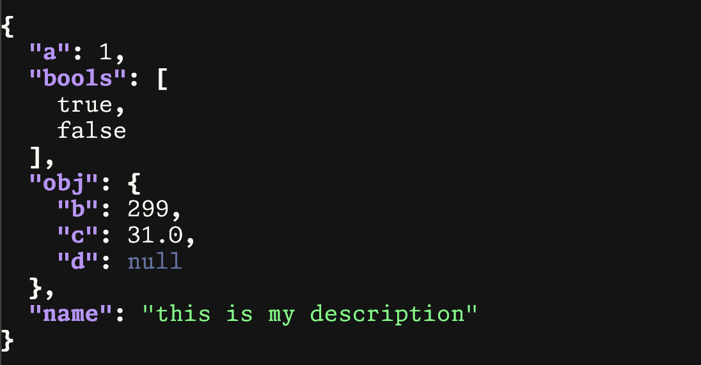

# 20240829 Using JQ with style

> Note: this article is intended for people that already love JQ!

*Did you know* that you can configure the colours of jq's output? This is a great way to make your output more readable in a way that you find visually appealing.

_This is detailed in the official docs [here](https://jqlang.github.io/jq/manual/#colors)_

There are only 2 things to know!

## 1. The ENV var

The `JQ_COLORS` ENV var is used to configure the colours. The default jq style is expressed as:

```shell
JQ_COLORS="0;90:0;37:0;37:0;37:0;32:1;37:1;37:1;34".
```

Using an ENV var means that configuring this in your shell rc files is easy, and doesn't slow anything down.

The ENV var contains a colon-separated list of ANSI colour codes, in the following order:

- color for null
- color for false
- color for true
- color for numbers
- color for strings
- color for arrays
- color for objects
- color for object keys

## 2. The colours

<table>
<tr>
    <th>Part 1 - Style</th>
    <th>Part 2 - Colour</th>
</tr>
<tr><td style='vertical-align: top'>

| value | style  |
|-------|--------|
| 1 | bright     |
| 2 | dim        |
| 4 | underscore |
| 5 | blink      |
| 7 | reverse    |
| 8 | hidden     |

</td><td style='vertical-align: top'>

| value | color   |
|-------|---------|
| 30    | black   |
| 31    | red     |
| 32    | green   |
| 33    | yellow  |
| 34    | blue    |
| 35    | magenta |
| 36    | cyan    |
| 37    | white   |

</td></tr>
</table>

## Examples

Now that we have the required pieces, we can create some different themes!

In order to make this process easier, I like to organise all of the options into named variables so that it's easier to experiment.

(For my shell, this lives in my `.bash_aliases`)

```python
_JQ_REGULAR=0
_JQ_BRIGHT=1
_JQ_DIM=2
_JQ_UNDERSCORE=4
_JQ_BLINK=5
_JQ_REVERSE=7
_JQ_HIDDEN=8

_JQ_BLACK=30
_JQ_RED=31
_JQ_GREEN=32
_JQ_YELLOW=33
_JQ_BLUE=34
_JQ_MAGENTA=35
_JQ_CYAN=36
_JQ_WHITE=37

JQ_NULL="$_JQ_DIM;$_JQ_YELLOW"
JQ_TRUE="$_JQ_DIM;$_JQ_YELLOW"
JQ_FALSE="$_JQ_DIM;$_JQ_YELLOW"
JQ_NUMBERS="$_JQ_REGULAR;$_JQ_CYAN"
JQ_STRINGS="$_JQ_REGULAR;$_JQ_WHITE"
JQ_ARRAYS="$_JQ_REGULAR;$_JQ_MAGENTA"
JQ_OBJECTS="$_JQ_BRIGHT;$_JQ_RED"
JQ_OBJECT_KEYS="$_JQ_BRIGHT;$_JQ_YELLOW"

export JQ_COLORS="${JQ_NULL}:${JQ_FALSE}:${JQ_TRUE}:${JQ_NUMBERS}:${JQ_STRINGS}:${JQ_ARRAYS}:${JQ_OBJECTS}:${JQ_OBJECT_KEYS}"
```

- 
  - default
<table>
<tr>
  <td>
  default
  </td>
  <td>
    
  </td>
</tr>
<tr>
  <td>
    <pre lang="python">
JQ_NULL="$_JQ_UNDERSCORE;$_JQ_WHITE"
JQ_TRUE="$_JQ_BRIGHT;$_JQ_GREEN"
JQ_FALSE="$_JQ_BRIGHT;$_JQ_RED"
JQ_NUMBERS="$_JQ_REGULAR;$_JQ_CYAN"
JQ_STRINGS="$_JQ_REGULAR;$_JQ_WHITE"
JQ_ARRAYS="$_JQ_REGULAR;$_JQ_BLUE"
JQ_OBJECTS="$_JQ_BRIGHT;$_JQ_RED"
JQ_OBJECT_KEYS="$_JQ_BRIGHT;$_JQ_YELLOW"
  </pre>
  </td>
  <td>
  
  </td>
</tr>
</table>
