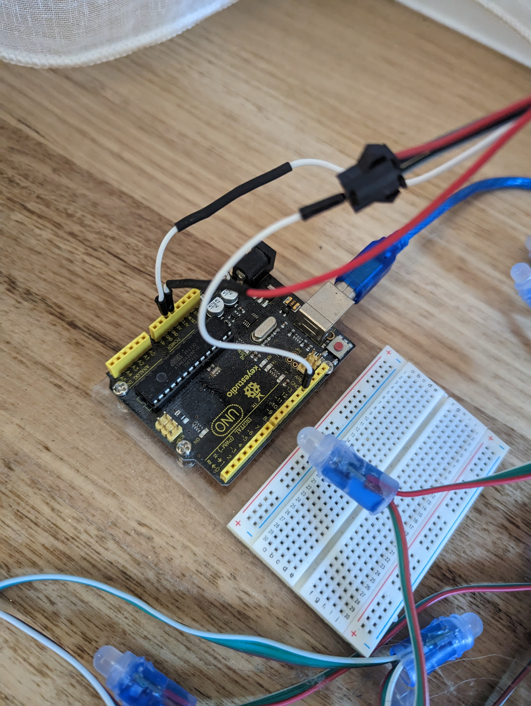

# 20241210 Christmas Tree Lights with Arduino

- [20241210 Christmas Tree Lights with Arduino](#20241210-christmas-tree-lights-with-arduino)
  - [Ingredients](#ingredients)
    - [An Arduino board](#an-arduino-board)
    - [A string of "WS8211" LEDs](#a-string-of-ws8211-leds)
    - [Some patience](#some-patience)

---

## Ingredients

### An Arduino board

I used an [Arduino Uno Rev3](https://store.arduino.cc/products/arduino-uno-rev3?srsltid=AfmBOopkKaQqk6dAzd3FSnn6As2fx5D9drFTa_u-T6UkvTjJvMcMctZt)

### A string of "WS8211" LEDs


### Some patience

Make sure you use the correct wires and ports! I struggled to find a wiring diagram on the internet, please accept this rough photo of my setup 😬:



### Some Code!

via: https://github.com/tmck-code/ardy-pardy/blob/main/projects/xmas/xmas.ino

> This uses the library `Adafruit_NeoPixel` as a dependency, which you can install via the Arduino IDE's Library Manager.

```c#
// A basic everyday NeoPixel strip test program.

#include <Adafruit_NeoPixel.h>
#ifdef __AVR__
#endif

#define LED_PIN   13
#define LED_COUNT 50
#define SLEEP     250
int PIXEL_OFFSET = 0;

#define WHITE  0
#define YELLOW 1
#define GREEN  2
#define RED    3

Adafruit_NeoPixel strip(LED_COUNT, LED_PIN, NEO_GRB + NEO_KHZ800);

// Green, Yellow
uint32_t COLOURS[] = {
  strip.Color(255, 255, 255),
  strip.Color(255, 255, 0),
  strip.Color(0,   255, 0),
  strip.Color(255,   0, 0)
};

int N_COLOURS = sizeof(COLOURS)/sizeof(COLOURS[0]);
uint32_t XMAS_DUO[2] = {RED, GREEN};
uint32_t XMAS_TRIO[3] = {RED, GREEN, YELLOW};

void setup() {
  Serial.begin(9600);

  strip.begin();
  strip.setBrightness(50);
  strip.show();

  Serial.println("Starting XMAS display with " + String(N_COLOURS) + " colours:");
}

void loop() {
  for (int i=0; i<N_COLOURS-1; i++) {
    colorWipe(COLOURS[i], SLEEP);
    if (i % 2 == 0) {
      xmas(XMAS_DUO, sizeof(XMAS_DUO)/sizeof(XMAS_DUO[0]), YELLOW);
    } else {
      xmas(XMAS_TRIO, sizeof(XMAS_TRIO)/sizeof(XMAS_TRIO[0]), WHITE);
    }
  }
}

// Fill strip pixels one after another with a color, and delay in ms.
// Strip is NOT cleared first; anything there will be covered pixel by pixel
void colorWipe(uint32_t color, int wait) {
  for(int i=0; i<strip.numPixels(); i++) {
    strip.setPixelColor(i, color);
    strip.show();
    delay(wait);
  }
}

void xmas(uint32_t repeat_colours[], int n_colours, int highlight_colour) {
  for (int i=1; i<strip.numPixels(); i++) {
    strip.setPixelColor(i, COLOURS[highlight_colour]);
    strip.setPixelColor(i-1, COLOURS[repeat_colours[i % n_colours]]);
    strip.show();
    delay(SLEEP);
  }
}
```