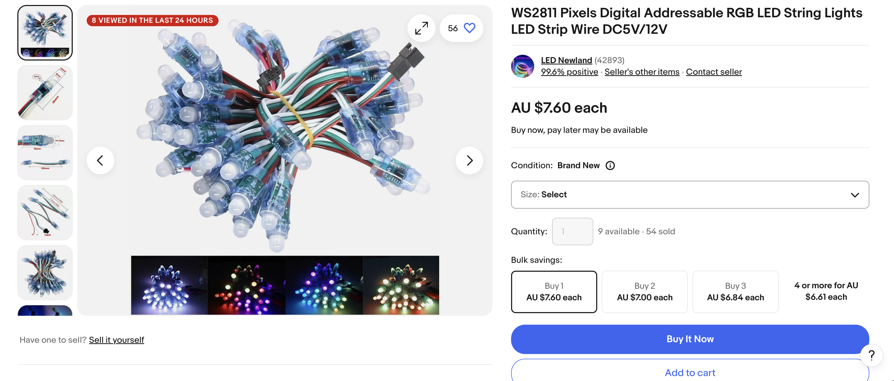

# 20241210 Christmas Tree Lights with Arduino

- [20241210 Christmas Tree Lights with Arduino](#20241210-christmas-tree-lights-with-arduino)
  - [Ingredients](#ingredients)
    - [An Arduino board](#an-arduino-board)
    - [A string of "WS8211" LEDs](#a-string-of-ws8211-leds)
    - [Some patience](#some-patience)

---

## Ingredients

### An Arduino board

I used an [Arduino Uno Rev3](https://store.arduino.cc/products/arduino-uno-rev3?srsltid=AfmBOopkKaQqk6dAzd3FSnn6As2fx5D9drFTa_u-T6UkvTjJvMcMctZt)

### A string of "WS8211" LEDs

### Some patience

Make sure you use the correct wires and ports! I struggled to find a wiring diagram on the internet, please accept this rough photo of my setup 😬:

### Some Code!

https://github.com/tmck-code/ardy-pardy/blob/main/projects/xmas/xmas.ino

https://github.com/tmck-code/ardy-pardy/blob/d6fb8b5343152abd73b4084c6ae885490007ca27/projects/xmas/xmas.ino#L1-L69

