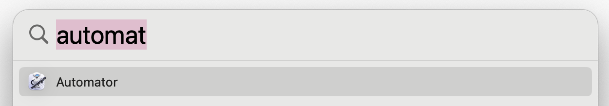
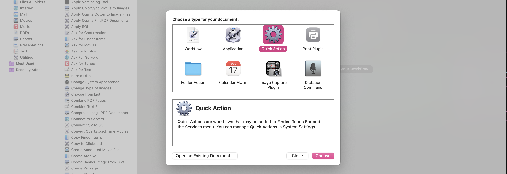
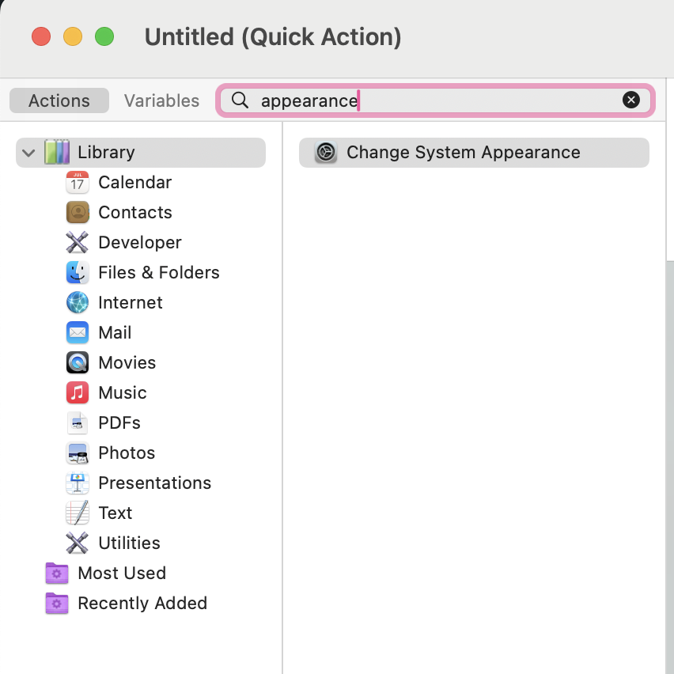
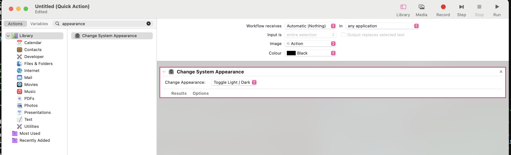
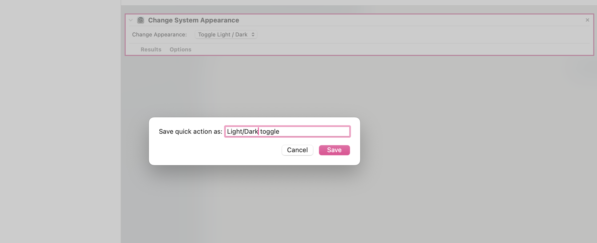
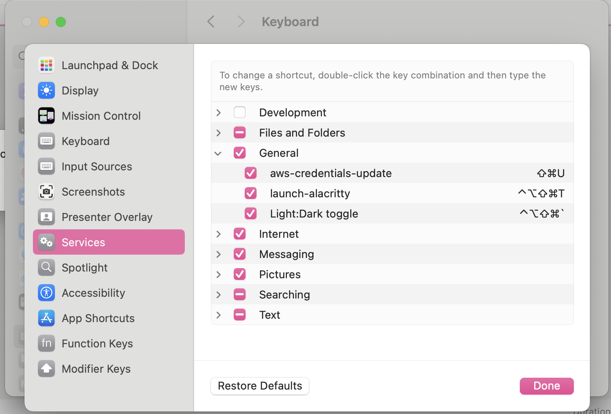

# 20250102 OSX dark mode shortcut

*Using the power of OSX Automator!*

> Automator offers many handy actions in OSX. After creating an "automation" in Automator, you can save it as a "Quick Action" and assign a keyboard shortcut to it in System Preferences.

*Documentation: https://support.apple.com/en-au/guide/automator/welcome/mac*

- [20250102 OSX dark mode shortcut](#20250102-osx-dark-mode-shortcut)
  - [1. Launch Automator](#1-launch-automator)
  - [2. Create "Quick Action"](#2-create-quick-action)
  - [3. Search for "appearance"](#3-search-for-appearance)
  - [4. Drag "Change System Appearance" to the workflow](#4-drag-change-system-appearance-to-the-workflow)
  - [5. Save the Quick Action](#5-save-the-quick-action)
  - [6. Assign a Keyboard Shortcut](#6-assign-a-keyboard-shortcut)

---

## 1. Launch Automator

## 2. Create "Quick Action"

## 3. Search for "appearance"

## 4. Drag "Change System Appearance" to the workflow

If you like, you can click "Run" in the top-right corner to test the action.

## 5. Save the Quick Action

## 6. Assign a Keyboard Shortcut

Open `System Preferences` > `Keyboard` > `Shortcuts` > `Services` > `General` and assign a keyboard shortcut to the Quick Action.

Done! Enjoy your new shortcut 🤓🙈