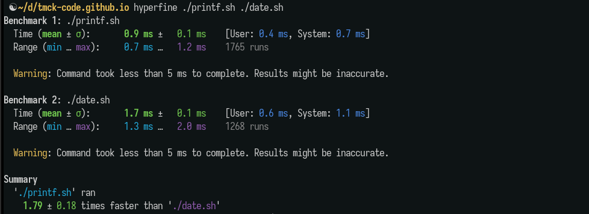

# 20250519 Get unix time FAST with pure bash

```shell
printf '%(%s)T\n' -1
```

> _Beware! There are a few different versions of `printf` that could be installed on your machine:_

```shell
☯ type -a printf
printf is a shell builtin
printf is /usr/bin/printf
printf is /bin/printf
```

The speed of this time command comes from the fact that it's a shell builtin and doesn't require forking a new process.

I'm too dumb to figure out how to benchmark this inline using `hyperfine`, so I just created 2 files with the commands and made them executable with `chmod +x`:

```shell
 ☯ cat date.sh
#!/bin/bash
date +%s

 ☯ cat printf.sh
#!/bin/bash
printf '%(%s)T\n'

```
## Results



_On the same machine, it takes `0.9` seconds to run a file that is completely empty (apart from the shebang), which leaves the `printf` command as being almost instant 🚀_