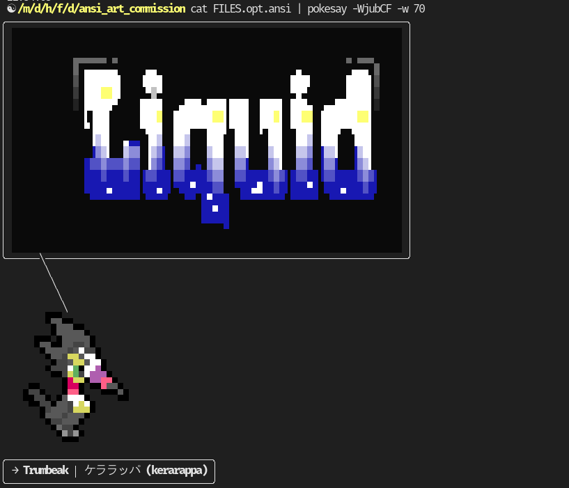
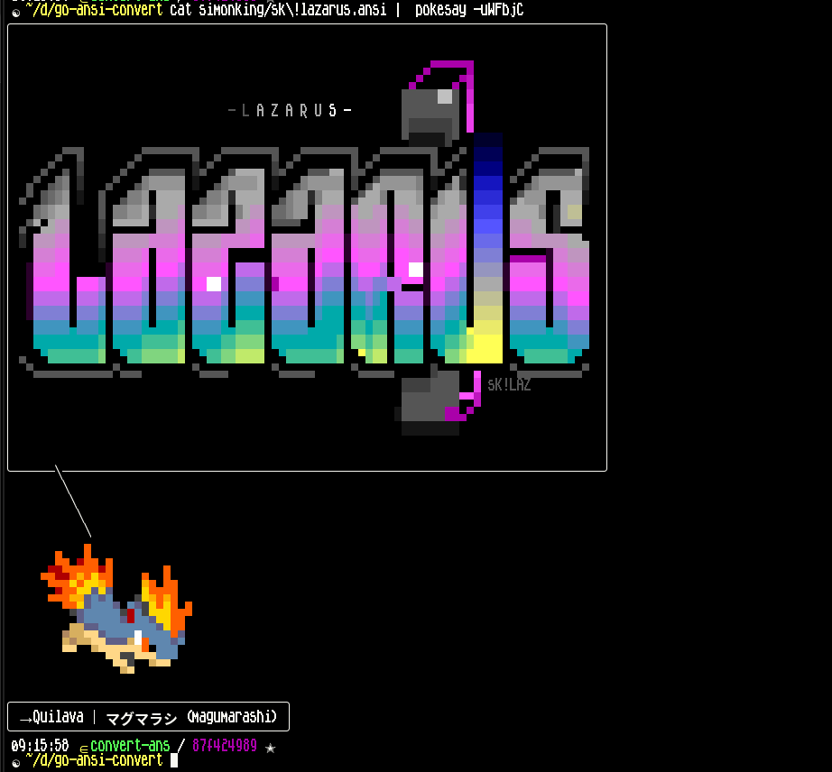
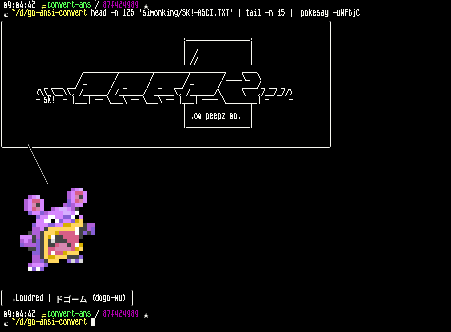
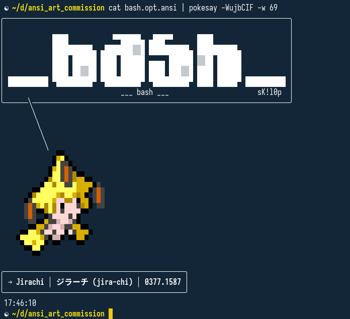
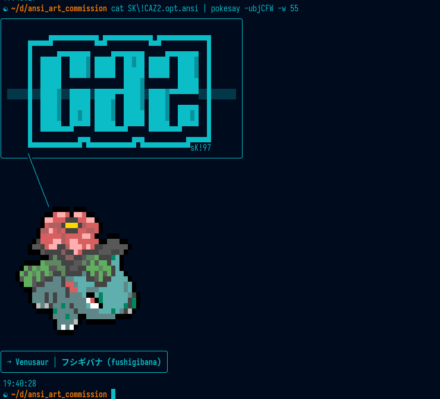
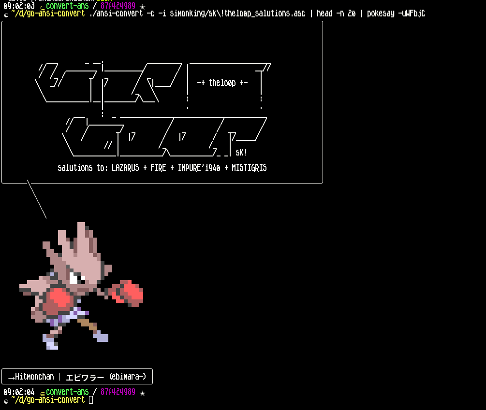
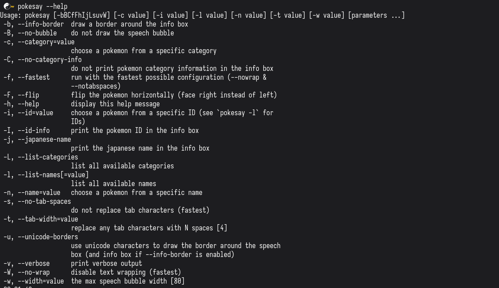
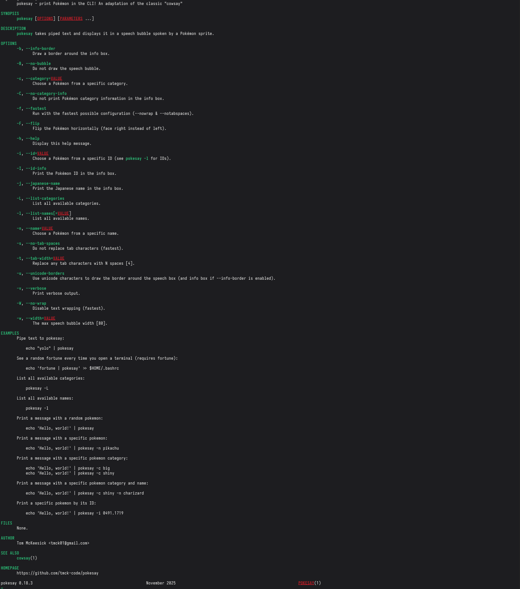

# ANSI Commission - Design Thoughts

Thanks for getting back to me! I'm excited to collaborate as I'm a fan of your work.

Legal/Licensing/Other

### 1. License

`pokesay` is licensed under the BSD-3-Clause license, which allows the code to be used in both open-source and proprietary software, provided that the original copyright notice and license terms are included (https://github.com/tmck-code/pokesay?tab=BSD-3-Clause-1-ov-file).

I'm happy to add a separate license for the artwork that does not allow it to be reused in this manner, if you'd like? Let me know your thoughts.

### 2. Monetization

`pokesay` is free, and will remain free forever. It's a passion project for me, and I don't intend to monetize it in any way, so I wouldn't be making any money off of your artwork.

### 3. Attribution

I'm happy to include your artist name/signature in all artworks that you provide, as well as in the README and documentation for the project.

### 4. Distribution

- `pokesay` is distributed via GitHub, aur (arch linux) and homebrew (macOS). These binaries/release files would include your artwork.
- The artwork would also be viewable on the GitHub README page.

Please let me know if you have any concerns or thoughts about this.

## Technical considerations

The `pokesay` binary runs on Linux, macOS, Windows and Android (via Termux). Predominantly, it's used in linux terminal environments.
It uses ASCII and UTF-8 chars with ANSI escape codes to display the pokemon sprites in the terminal, as well as borders for the speech bubbles and info box.

Ideally, the artwork would need to be in UTF-8 format if possible? I know that many ANSI artists use the CP437 character set which isn't compatible, is it an issue to create the art in UTF-8 instead?
It's not a deal-breaker if so, I can convert it to UTF-8 using durdraw, but sometimes the conversion isn't perfect so would prefer to have the artwork in UTF-8 if possible.

## Design thoughts

### 1. The title

I'd love some text that says "pokesay"
- Ideally a width of 70-80 chars, and a height of 12-20
- it can either upper or lower case, whichever you think looks best
- it would be displayed by the `pokesay` program in the terminal when a special arg is provided (e.g. `pokesay --title` or `pokesay --demo`)
- I'd also display a screenshot of this at the top of the GitHub README page, replacing the current one that I just made with figlet
- I like many of the colourful designs that you do. In terms of the palette/font to use, I'd rather avoid any potential legal issues with Nintendo, so 
  - _some_ yellow and blue would be nice, as it would match the original pokemon colours.
  - but it shouldn't be _only_ yellow and blue
  - The font should be different to the original pokemon font

#### Examples

I gathered some of my favourite examples that you've done for coloured titles and demo'd what they'd look like in `pokesay` below. There are installation instructions in the README and you could use it to test out your designs, if that's helpful.

>[!NOTE] _I used durdraw to convert the .ANS file to UTF-8, however it has a few problems with the ansi codes. I tried to fix them up manually but it was too much effort to fully fix the SK!BULL.ANS one. Just letting you know that it's not `pokesay` that's doing this._

| example 1 | example 2 | example 3 |
|-----------|-----------|-----------|
|  _[FILES.BBS](https://16colo.rs/pack/l0p17_02/FILES.BBS)_ |  _[sk!lazarus.ans](https://16colo.rs/pack/laz17/sk%21lazarus.ans)_ |  [sk!asci.txt](https://16colo.rs/pack/l0p14_02/SK%21-ASCI.TXT) _ |
|  https://16colo.rs/pack/l0p24_08/sk%21bash.asc |  https://16colo.rs/pack/caz-01/SK%21CAZ2.ASC |  https://16colo.rs/pack/l0p10_01/SK%21ASC01.ASC |
|  [sk!thelo0p_salutions](https://16colo.rs/pack/impure88/sk%21thelo0p_salutions.asc) | | |

### 2. The help doc

I have both a manpage and `--help` output for the program that lists all of the available args and options.
This art would be displayed when the user runs `pokesay --help`.

The help output currently looks like this:

The manpage currently looks like this:

In terms of the design,

- Ideally 80 chars wide
- The main title could incorporate the title design from above, but vary slightly
  - Or it could be a different design if you have the time
  - I like a lot of the titles that you do that are in the style of the 'SK!MF.TXT' example below
- Some colour in the help section underneath would be nice, like the `SK!MENU.ANS` example below
- Some titles separating the different doc sections would be good, like in the `SK!MF.TXT` example below
- The `--help` docs currently only show the command-line arguments. I'd like to add more sections to it from the manpage like "Examples"

TL;DR, something like the title from `SK!MF.TXT` for the top, some section titles from that same file, and some colourful CLI arg descriptions from `SK!MENU.ANS` in the top section.

<table>
  <thead>
    <tr>
      <th>example 1</th>
      <th>example 2</th>
    </tr>
  </thead>
  <tbody>
    <tr>
      <td style="vertical-align: top;">https://16colo.rs/pack/l0p14_02/SK%21MENU.ANS </td>
      <td style="vertical-align: top;">https://16colo.rs/pack/l0p19_03/SK%21MF.TXT </td>
    </tr>
  </tbody>
</table>